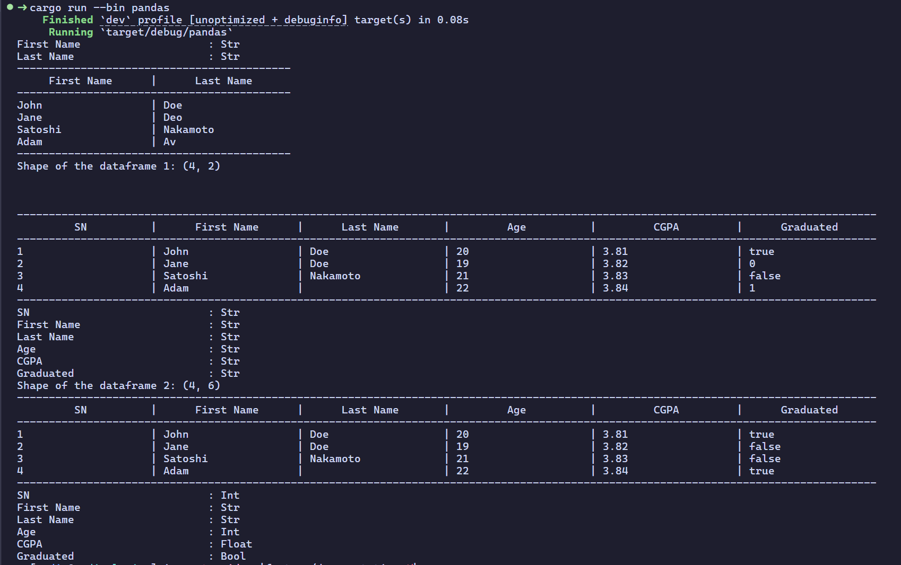
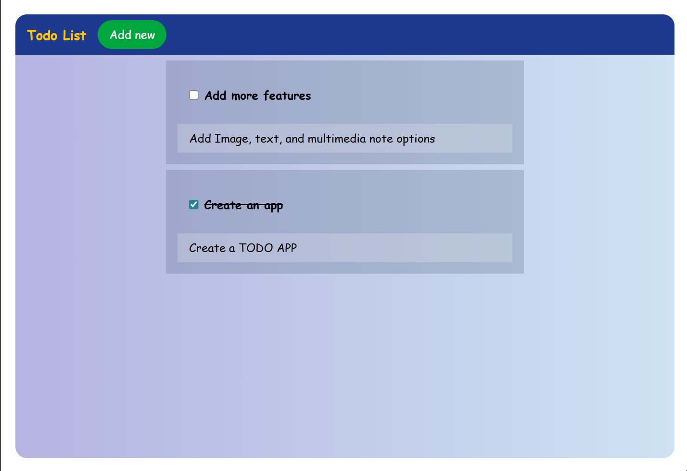
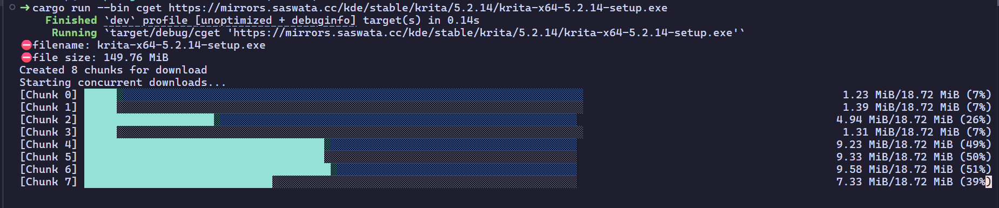

# Rust Raid


> [!IMPORTANT]
> **DISCLAIMER !!**
>
> This project is not affiliated with, endorsed by, or sponsored by the Rust
> Foundation or the Rust programming language project. "Rust" and the Rust logo
> are trademarks of the Rust Foundation.
> For details on trademark usage, please refer to the Rust Foundation Trademark
> Policy.

[Rust Raid](https://github.com/ghimiresdp/rust-raid) is a repository for Rust
learners and coding challenge seekers.

> [!NOTE]
> In some linux distributions (especially WSL), the following packages
> might need to be installed to run some binaries that require network request.
>
> 1. **`pkg-config`**
> 2. **`libssl-dev`**
>
> Example commands for installing in ubuntu
>
> ```sh
> sudo apt install pkgconf
> sudo apt install libssl-dev
> ```
>
> You can check similar commands for other distributions

**The repository contains the following**:

- `Algorithms` that can be used to solve various problems.
- `Examples` of different `design patterns` and `data structures`.
- `solutions` to diverse challenges categorized by different topics(workspaces).
- `advanced concepts` that include memory management, multiprocessing, etc.
- `Demo projects` to polish your skills to the depth.

Each workspace contains multiple binaries so that it will be easier to run
a specific problem by selecting binaries.

You can run the `cargo run --bin <binary_name>` to run binaries. To run all test
cases, you can run `cargo test` command, or to run specific test, you can run
`cargo test --bin <binary_name>`

```sh
# Example: running binary for huffman encoding
cargo run --bin huffman
cargo test --bin huffman
```

> [!NOTE]
> _Topics that do not contain hyperlinks are work in progress and will be_
> _updated once the solution gets completed._
>
> _You can also create a PR with the solution/enhancement to each topic._

## [1. Data Structures and Algorithms](crates/dsa/)

### [1.1. Data Structures](crates/dsa/src/structures/)

1. **Arrays**
   - [Find the missing number](crates/dsa/src/structures/missing-number.rs)
     `cargo run --bin missing-number`
   - [Find the length of the longest subarray with sum K](crates/dsa/src/structures/longest-subarray.rs)
     `cargo run --bin longest-subarray`
2. **Singly Linked Lists**
   - [Add two numbers represented by linked list](crates/dsa/src/structures/linked-list-add.rs)
     `cargo run --bin linked-list-add`
3. [**Doubly Linked Lists**](crates/dsa/src/structures/doubly_linked_list.rs)
   `cargo run --bin doubly_linked_list`

4. [**Stacks**](crates/dsa/src/structures/stack.rs) `cargo run --bin stack`
5. [**Queues**](crates/dsa/src/structures/queue.rs) `cargo run --bin queue`
6. [**Binary Trees**](crates/dsa/src/structures/binary_tree.rs)
   `cargo run --bin binary_tree`
7. [**Trie**](crates/dsa/src/structures/trie.rs) `cargo run --bin trie`

### [1.2. Algorithms](crates/dsa/src/algorithms/README.md)

#### [1.2.1. Searching](crates/dsa/src/algorithms/searching/)

1. [Linear Searching](crates/dsa/src/algorithms/searching/linear_search.rs)
   `cargo run --bin linear_search`
2. [Binary Searching](crates/dsa/src/algorithms/searching/binary_search.rs)
   `cargo run --bin binary_search`
3. [Depth First Search (DFS)]
4. [Breadth First Search (BFS)]

#### [1.2.2. Sorting](crates/dsa/src/algorithms/sorting/)

1. [bubble sort](crates/dsa/src/algorithms/sorting/bubble_sort.rs)
   `cargo run --bin bubble_sort`
2. [selection sort](crates/dsa/src/algorithms/sorting/selection_sort.rs)
   `cargo run --bin selection_sort`
3. [insertion sort](crates/dsa/src/algorithms/sorting/insertion_sort.rs)
   `cargo run --bin insertion_sort`
4. [quick sort](crates/dsa/src/algorithms/sorting/quick_sort.rs)
   `cargo run --bin quick_sort`
5. [Merge sort](crates/dsa/src/algorithms/sorting/merge_sort.rs)
   `cargo run --bin merge_sort`
6. [heap Sort]
7. [Counting Sort]
8. [Radix Sort]

#### [1.2.3 Greedy and Graph Algorithms](crates/dsa/src/algorithms/greedy/)

1. [Activity Selection]
2. [Huffman Coding](crates/dsa/src/algorithms/greedy/huffman_coding.rs)
   `cargo run --bin huffman`
3. [Krushkal's algorithm](crates/dsa/src/algorithms/greedy/kruskal.rs)
   `cargo run --bin kruskal`
4. [Prim's Algorithm]
5. [Dijkstra's Algorithm]
6. [Bellman-Ford Algorithm]
7. [Floyd-Warshall Algorithm]
8. [Topological Sort]
9. [A* Search Algorithm]

#### [1.2.4. Miscellaneous Algorithms](crates/dsa/src/algorithms/misc/)

1. [Luhn's algorithm to validate credit card number.](crates/dsa/src/algorithms/misc/luhn.rs)

   ```sh
   cargo run --bin luhn
   cargo test --bin luhn
   ```

## [2. Design Patterns](crates/design-patterns/README.md)

1. [Singleton Pattern](crates/design-patterns/src/singleton.rs)
   `cargo run --bin singleton`
2. [Factory Pattern](crates/design-patterns/src/factory.rs)
   `cargo run --bin factory`
3. [Builder Pattern](crates/design-patterns/src/builder.rs)
   `cargo run --bin builder`
4. [Decorator Pattern](crates/design-patterns/src/decorator.rs)
   `cargo run --bin decorator`
5. [Observer Pattern](crates/design-patterns/src/observer.rs)
   `cargo run --bin observer`
6. [Strategy Pattern](crates/design-patterns/src/strategy.rs)
   `cargo run --bin strategy`
7. [Command Pattern](crates/design-patterns/src/command.rs)
   `cargo run --bin command`
8. [Adapter Pattern](crates/design-patterns/src/adapter.rs)
   `cargo run --bin adapter`

## [3. Problem Solving](crates/problem-solving/README.md)

### [3.1. Basic Problems](crates/problem-solving/src/basic/)

1. [Practical Number](crates/problem-solving/src/basic/practical_number.rs)
   `cargo run --bin practical_number`
2. [Greatest Common Divisor](crates/problem-solving/src/basic/gcd.rs)
   `cargo run --bin gcd`
3. [Median](crates/problem-solving/src/basic/median.rs)
   `cargo run --bin median`
4. [Reverse digits of the integer](crates/problem-solving/src/basic/reverse_integer.rs)
   `cargo run --bin reverse_integer`
5. [List Comprehension](crates/problem-solving/src/basic/comprehension.rs)
   `cargo run --bin comprehension`
6. [Linear Regression Model](crates/problem-solving/src/basic/linear_regression.rs)
   `cargo run --bin linear_regression`
7. [Matrix Multiplication Model](crates/problem-solving/src/basic/matrix_multiplication.rs)
   `cargo run --bin matrix_multiplication`
8. [Color Converter](crates/problem-solving/src/basic/color-converter.rs)
   `cargo run --bin color-converter`

### [3.2. Dynamic Programming](crates/problem-solving/src/dp/)

1. [List group by consecutive numbers](crates/problem-solving/src/dp/consecutive_groups.rs)
   `cargo run --bin consecutive_groups`
2. [Find the length of the longest substring with maximum 2 repetition](crates/problem-solving/src/dp/repeat.rs)
   `cargo run --bin repeat`
3. [Find the index of two numbers in an array whose sum equals to the provided target](crates/problem-solving/src/dp/two_sum.rs)
   `cargo run --bin two_sum`
4. [Minimize the Sum from an array](crates/problem-solving/src/dp/minimize_sum.rs)
   `cargo run --bin minimize_sum`
5. [Fibonacci Series](crates/problem-solving/src/dp/fibonacci.rs)
   `cargo run --bin fibonacci`
6. [Longest Common Subsequence](crates/problem-solving/src/dp/longest_common_subsequence.rs)
   `cargo run --bin lcs`
7. [Coin Change Problem](crates/problem-solving/src/dp/coin_change.rs)
   `cargo run --bin coin_change`
8. [Palindrome Partition](crates/problem-solving/src/dp/palindrome_partition.rs)
   `cargo run --bin palindrome_partition`
9. [Find Nth distinct number](crates/problem-solving/src/dp/nth-dFFistinct-number.rs)
   `cargo run --bin nth-distinct-number`
10. [Find the length of the longest substring without duplicates](crates/problem-solving/src/dp/longest-substring.rs)
    `cargo run --bin longest-substring`

## [4. Advanced Concepts](crates/advanced/README.md)

### 4.1. Memory Management

- [Ownership, borrowing, and Lifetimes](crates/advanced/memory-management/src/ownership.rs)
  `cargo run --bin ownership`
- [Unsafe Rust](crates/advanced/memory-management/src/unsafe.rs)
  `cargo run --bin unsafe`

### 4.2. Type System and Generics

- [Generic Types](crates/advanced/types-and-generics/src/generics.rs)
  `cargo run --bin generics`
- [Trait Objects and Dynamic Dispatch](crates/advanced/types-and-generics/src/traits.rs)
  `cargo run --bin traits`
- Associated types and Generic Type parameters
- Lifetime Sub-typing

### 4.3. Concurrency and Parallelism

- [`Async/Await` and `Futures`](crates/advanced/concurrent-programming/src/threading.rs)
  `cargo run --bin threading`
- [Thread Spawning](crates/advanced/concurrent-programming/src/spawning.rs)
  `cargo run --bin spawning`

### 4.4. Macros and Meta programming

- [`macro_rules!`](crates/advanced/meta-programming/src/macro-rules.rs)
  `cargo run --bin macro`
- [Derive Macros](crates/advanced/meta-programming/src/derive-macro.rs)
  `cargo run --bin derive`
- [Building Domain-Specific Languages (DSL)](crates/advanced/meta-programming/src/dsl.rs)
  `cargo run --bin dsl`

### 4.5. Low-level and systems programming

- [Conditional Compilation](crates/advanced/systems-programming/src/conditional-compilation.rs)
  `cargo run --bin cc`
- [Inline Assembly](crates/advanced/systems-programming/src/inline-assembly.rs)
  `cargo run --bin assembly`
- Foreign Function Interface (FFI)
- Embedded rust and Bare-metal programming

### 4.6. Error handling and patterns

- [Unrecoverable error and `panic!` macro](crates/advanced/error-handling/src/panic.rs)
  `cargo run --bin panic`
- [Recoverable error and `Result` enum](crates/advanced/error-handling/src/result.rs)
  `cargo run --bin result`
- Advanced Error Handling
  - [Propagating Errors with `?` operator](crates/advanced/error-handling/src/propagation.rs)
    `cargo run --bin propagation`
  - [Custom Errors](crates/advanced/error-handling/src/custom-error.rs)
    `cargo run --bin custom-error`
- Dependency Injection patterns in rust

### [4.7. Operator Overloading](crates/advanced/operator-overloading/src/main.rs)

```sh
cargo run --bin operator-overloading
```

- Example 1: Operator Overloading in structs (overloading `+` and `-` operators)
- Example 2: Matrix Multiplication ( overloading `*` operator)
- Example 3: Scalar Multiplication
  (operator overloading with heterogeneous data type)

### 4.8. Smart Pointers

- [Box Pointers](crates/advanced/smart-pointers/src/box.rs)
  `cargo run --bin box`
- [Reference Counters (`Rc`)](crates/advanced/smart-pointers/src/rc.rs)
  `cargo run --bin rc`
- [`RefCell`](crates/advanced/smart-pointers/src/refcell.rs)
  `cargo run --bin refcell`
- [`Arc Mutex`](crates/advanced/smart-pointers/src/arc-mutex.rs)
  `cargo run --bin arc-mutex`

### 4.9. Specialized topics

- Writing a custom allocator
- Self-referential structs (`box`, `rc`, `Arc`)

---

## [5. Projects](./projects/)

### [1. `pandas` - pandas-like mini-dataframe container project](projects/pandas/README.md)

Command:

```sh
cargo run --bin pandas
```



---

### [2. `ruscrypt` - A basic encryption mini-project](projects/ruscrypt/README.md)

Command:

```sh
cargo run --bin ruscrypt
```

---

### [3. Basic Password `vault`](projects/vault/README.md)

Command:

```sh
cargo run --bin vault
```

---

### [4. A Basic `TODO` Web Application mini project](projects/todo-web/README.md)

Command:

```sh
cargo run --bin todo
```

and browse: <http://localhost:8080>



---

### [5. `cget` - a wget-like file downloader utility with multithreading](projects/cget/Cargo.toml)

Command: `cargo run --bin cget <DOWNLOAD_URL>`

Example:

```sh
cargo run --bin cget https://mirrors.saswata.cc/kde/stable/krita/5.2.14/krita-x64-5.2.14-setup.exe
```



> [!NOTE]
> [furl-cli (or fURL)](https://github.com/ghimiresdp/furl-cli)
> is a successor to this project. It incorporates refined logic, improved
> multithreading, and other features such as better error handling, and pause
> and resume download from the original implementation.

## Running binaries

To run any binary, you can run the command `cargo run --bin <bin_name>`

Example:

```sh
cargo run --bin practical_number
```

> [!NOTE]
> Binary names might not always be the name of the file. Sometimes, a
> shorter version of the solution name is used to make easier to type. You can
> see the name of binary in the respective `README.md` file or the `docstring`
> of the respective solution.
> Example:
>
> - The binary for `huffman_coding.rs` is just `huffman`.

## Testing

There are test cases for each function/challenge that will be beneficial
for you to learn testing as well as test programs for errors.

To test programs, you can run `cargo test` command.

Example:

```sh
cargo test

# alternatively, to test individual binary, you can run
cargo test --bin your_program_name
```
